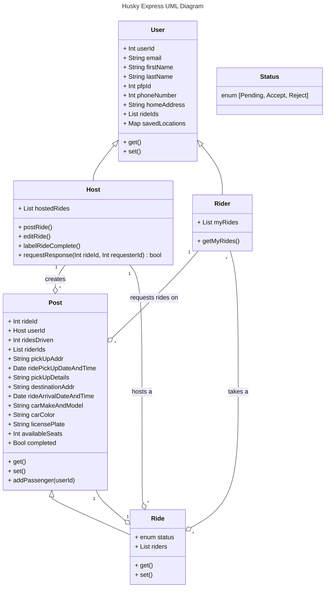

# Husky Express
## Team: Guardians of the Galaxy
### Members: Kevin Van, Daniel Hartanto, Cheng Cheng, Morgan Levy
 

# Software Requirement Specification (SRS)

## Purpose 

### Definitions 

* Carpool - A group of NEU Students comprised of a Host and Passenger(s), where the Host will facilitate transportation of their Passenger(s) to/from campus 

* User - All users of the Carpool Application must be NEU Seattle students, but may either be in the role of Host or Passenger within a Carpool 

* Host - An NEU student with self-procured mobile transportation who has elected to facilitate a carpool for other NEU students living in their area 

* Passenger - An NEU student without mobile transportation who has joined a Carpool with a hosting NEU Student in their area 

* Campus - Specifically, NEU Seattle’s campus in South Lake Union 

## Background 

NEU-Seattle is located in the heart of South Lake Union, an area primarily inhabited by businesses and higher-income residential spaces. NEU-Seattle does not have dormitories available to students. As a satellite campus on the West Coast, NEU-Seattle is home to many students studying from overseas. The resulting scenario of these factors is that many students are without consistent transportation, commuting to campus from less urban areas around the Greater Seattle Area.  

## Overall Description 

### User Characteristics 

* Students attending NEU Seattle Campus who: 

* Live far away from campus, but close to other students 

* Struggle with commute costs 

* Do not have time to commit to using public transport services 

* Desire to communicate with potential classmates 

* Want to be more eco-conscious/environmentally friendly 

### User Stories  

* As a NEU student who lives 20 minutes away from the campus and does not have a car, I want to locate a host who lives in my area so that I do not need to travel too far to take the drive.  

* As a NEU student who has a car, I want to meet my passengers at a specific location so that I do not need to expose my address and spend extra time traveling to pick them up. 

* As a NEU student who lives from the campus in a long distance and takes Uber to the campus, I want to find a carpool to the campus so that it can reduce my commute costs.  

* As a NEU student who usually takes extra time to travel to a bus station and needs to transfer twice while using public transport services, I want a non-stop carpool service to the campus that departs close to my house so that it saves my time commuting. 

* As a NEU first year student who does not have many friends on campus, I want to share a ride with other students so that I can meet new people and talk to them in person. 

* As a NEU student and an environmentalist, I want to carpool with other students because I want to be more eco-conscious.  

* As a driver who had an existing carpool group, I want to invite more students into our group because there is sufficient space in my car so that I have a chance to connect with potential classmates.  

* As a driver/passenger, I want to save a recurring carpool post so that I do not need to create a host/look post every time. 
 

## App Workflow (Flowchart) 

 

## Requirements 

### Functional 

1. As a User, they will be able to: 

    * User Authentication when they try to log in 

        * New Users will need to include their phone number and NEU email before interacting with the app 

    * View their carpool history 

        * Filter carpool history [All Rides, Passengers Rides, Hosted Rides] 

    *  Talk with the anyone that involves with the carpool ride (fellow riders and the carpool driver through chat and phone calls using the devices) 

    * Filter all the posts when a user is looking for a specific carpool and the posts will be filtered by: 

        * Date of ride 

        * Time range of the carpool will be done 

        * Location and the time of the carpool’s pick-up point 

        * Area search radius from pick-up point 

    * Edit Profile: 

        * Name 

        * PFP 

        * Home Address 

        * Phone Number 

        * Password 

    * Add, Edit and Delete Saved Locations for ease of access in address inputs 

    * View upcoming host/rides on Home Page 

    * Edit text size of application via Settings Page 

    * Review Terms of Service via Settings Page 

2. As a host, they will be able to: 

    * Create a -host a carpool- post 

        * Upon creating, the user can decide the number of rider(s) available in the ride 

        * Having the rider(s) to be picked up only from one location on certain time 

        * List the ride’s destination’s location and time 

    * Edit a -host for a carpool- post 

    * Delete a -host for a carpool- post 

    * Accept and Decline Ride Requests 

    * Participate in a Carpool chat with confirmed riders 

3. As passengers, they will be able to: 

    * Search for carpools, with filtered by:  

        * Date 

        * Time 

        * Location 

    * View the carpool’s posts details: 

        * Date 

        * View the pickup location  

        * Time of pickup 

        * Arrival Time 

        * Details of Car (make, model, color, capacity) 

        * Host and other Riders 

            * Number of available seats  

        * Map representation of the trip 

        * Post details from Host 

        * Number of rides the host has driven (experience level) 

    * Receive notifications from the driver during carpools  

    * Call the host of the carpool 

   * Participate in a Carpool chat with the host and other confirmed riders 

### Non-functional 

* App will remember user when they log in from same device 

* App will be compatible with IOS and Android platforms 

* App will facilitate new interactions among students 

* App will be scaled to NEU-Seattle campus, with functions localized to the Greater Seattle Area 

### Features (Optional) 

* Add compensation to drivers and payment system 

* Request drivers to upload driver license 

* Save recurring rides/host 

* Users able to log in with phone number after verifying their email 

* Settings 

    * Toggle to Colorblind Accessible Mode 

    * Toggle to allow Push Notifications 

    * Toggle to switch to Dark Mode 

 

# Wireframes

Low Fidelity

 

Medium Fidelity

 

High Fidelity

 

# Class Diagram - UML

Team Guardians of the Galaxy: Cheng Cheng, Kevin Van, Morgan Levy, Daniel Hartanto

Uml Diagram for Husky Express, our teams vision for a NEU: Seattle Campus carpool mobile application

 

# Gannt Chart/ Timeline

 

# Traceability Matrix

