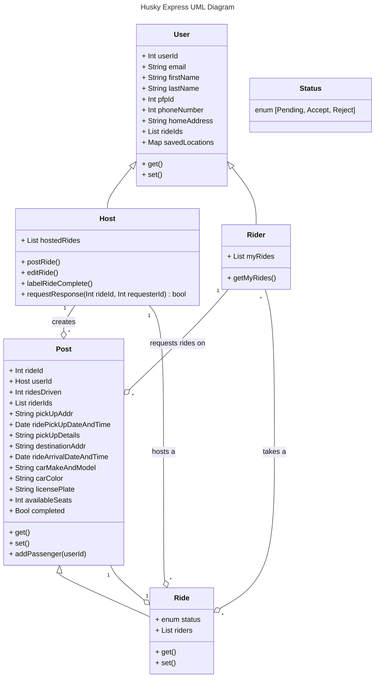

# Class Diagram - UML

Team Guardians of the Galaxy: Cheng Cheng, Kevin Van, Morgan Levy, Daniel Hartanto

Uml Diagram for Husky Express, our teams vision for a NEU: Seattle Campus carpool mobile application

